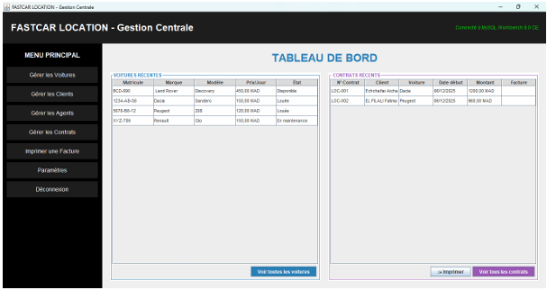
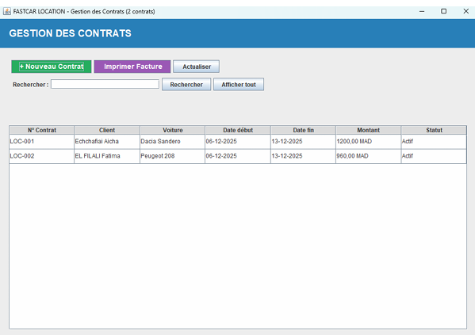
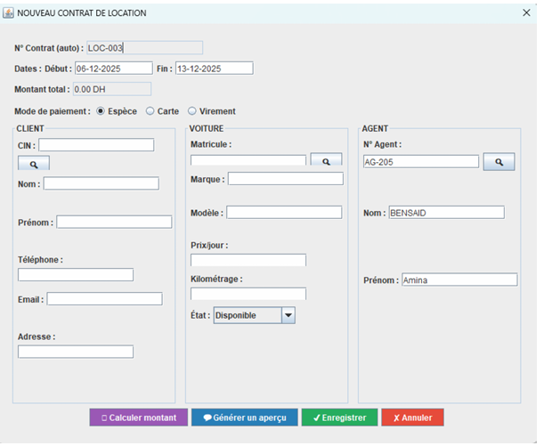
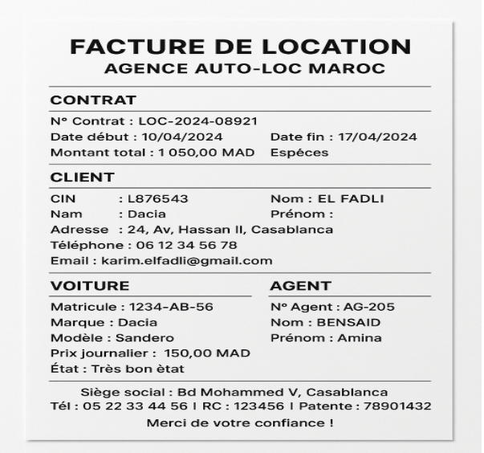

 
# 🚗 FastCar Location - Système de Gestion d'Agence de Location de Voitures

[](https://www.oracle.com/java/)
[](https://www.mysql.com/)
[](https://docs.oracle.com/javase/tutorial/uiswing/)
[](LICENSE)

Une application de gestion complète pour l'agence **FastCar Location de Marrakech**, développée en **Java Swing** avec base de données **MySQL**. Cette solution remplace la gestion manuelle papier par un système informatisé, robuste et évolutif.

## 🎯 Objectif du projet

Face aux limites d'une gestion entièrement manuelle (dossiers papier, registres physiques), l'agence FastCar Location avait un besoin urgent de modernisation. Cette application offre :

- Une gestion centralisée et sécurisée des données
- Une facturation automatique et rapide
- Un suivi en temps réel de la disponibilité des véhicules
- Une traçabilité complète des locations et transactions

## 📸 Aperçu de l'application

<div align="center">
  
  <br/>
  <em>Figure 1 : Interface principale – Dashboard de gestion FastCar</em>
</div>

<br/>

<div align="center">
  
  <br/>
  <em>Figure 2 : Interface de gestion des contrats</em>
</div>

## 📋 Fonctionnalités implémentées

### 1. 🚙 Gestion des véhicules
| Fonction | Description |
|----------|-------------|
| Ajout | Formulaire complet avec validation des champs obligatoires |
| Modification | Édition avec vérification de disponibilité |
| Suppression | Vérification préalable des contrats actifs |
| Consultation | Tableau interactif avec filtrage (disponibilité, marque, modèle) |
| Recherche | Recherche multicritère avec suggestions en temps réel |
| Suivi état | Mise à jour automatique : Disponible → Loué → En maintenance |

**Classe principale :** `GestionVoituresFrame.java`

### 2. 👤 Gestion des clients
- Saisie sécurisée avec validation du CIN (format et unicité)
- Mise à jour des coordonnées avec conservation de l'historique
- Suppression avec vérification des contrats en cours
- Recherche par CIN, nom, prénom ou téléphone

**Classe principale :** `GestionClientsFrame.java`

### 3. 👔 Gestion des agents
- Enregistrement avec identification unique
- Contrôle d'intégrité référentielle avant suppression
- Indicateur de performance (nombre de contrats gérés)

**Classe principale :** `GestionAgentsFrame.java`

### 4. 📄 Gestion des contrats

<div align="center">
  
  <br/>
  <em>Figure 3 : Formulaire de création d'un nouveau contrat</em>
</div>

- Sélection dynamique : client, véhicule (filtrage auto par disponibilité), agent
- Calcul automatique du montant (durée × prix journalier)
- Génération automatique du numéro de contrat
- Recherche multicritère (numéro, client, véhicule, période)

**Classe principale :** `GestionContratsFrame.java`

### 5. 🧾 Génération de factures

<div align="center">
  
  <br/>
  <em>Figure 4 : Exemple de facture générée automatiquement</em>
</div>

| Fonction | Description |
|----------|-------------|
| Génération | Création automatique aux formats HTML et texte |
| Personnalisation | En-tête avec logo, détails complet du contrat |
| Impression | Impression directe via API Java Print |
| Export | Sauvegarde au format .txt pour archivage |
| Aperçu | Visualisation avant impression |

**Classe utilitaire :** `ImprimerFacture.java`

## 🏗️ Architecture du projet (Méthode MERISE)

Le projet suit la méthodologie MERISE avec les étapes suivantes :

| Étape | Description |
|-------|-------------|
| **DDE** | Dictionnaire des Données Épuré - Recensement normalisé des données |
| **GDF** | Graphe des Dépendances Fonctionnelles - Relations logiques entre données |
| **MCD** | Modèle Conceptuel de Données - Entités et associations |
| **MLD** | Modèle Logique de Données - Schéma relationnel implémentable |

### Modèle physique de données

```sql
AGENT (Num_Agent, Nom_Agent, Prénom_Agent)
CLIENT (CIN_Client, Nom_Client, Prénom_Client, Adr_Client, Télé_Client, Email_Client)
VÉHICULE (Matricule, Marque, Modèle, Prix_Journalier, État, Kilométrage)
CONTRAT (Num_Contrat, Date_Début, Date_Fin, Montant_Total, Mode_Paiement, 
         #Num_Agent, #CIN_Client, #Matricule)
